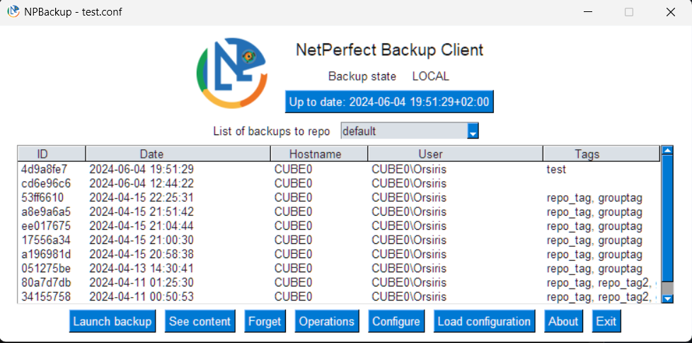
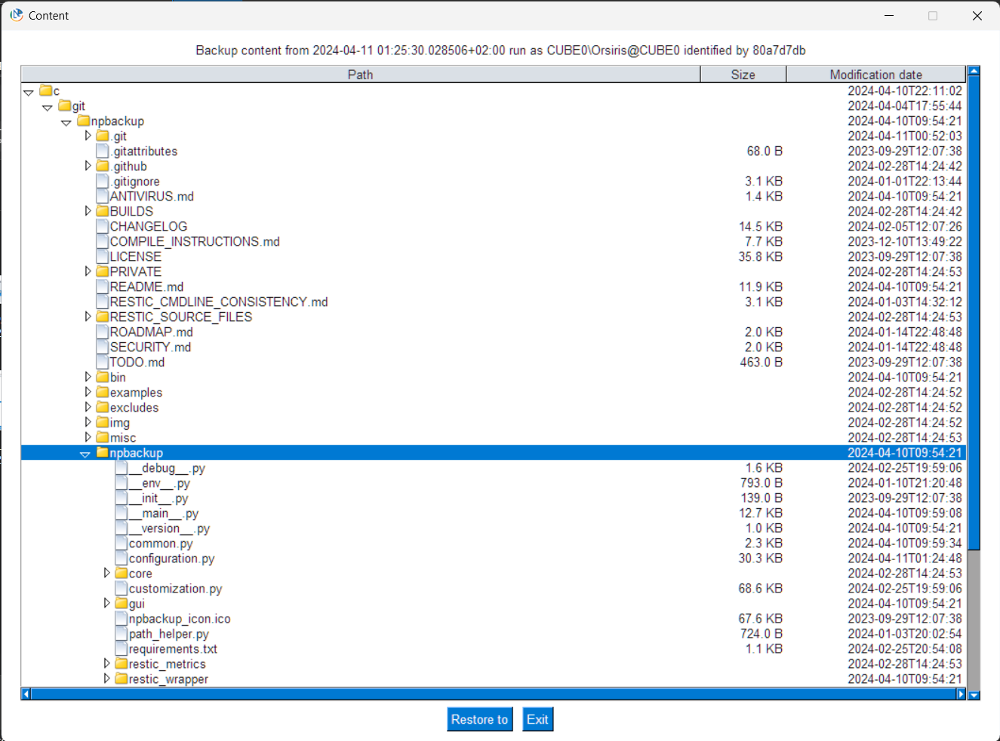
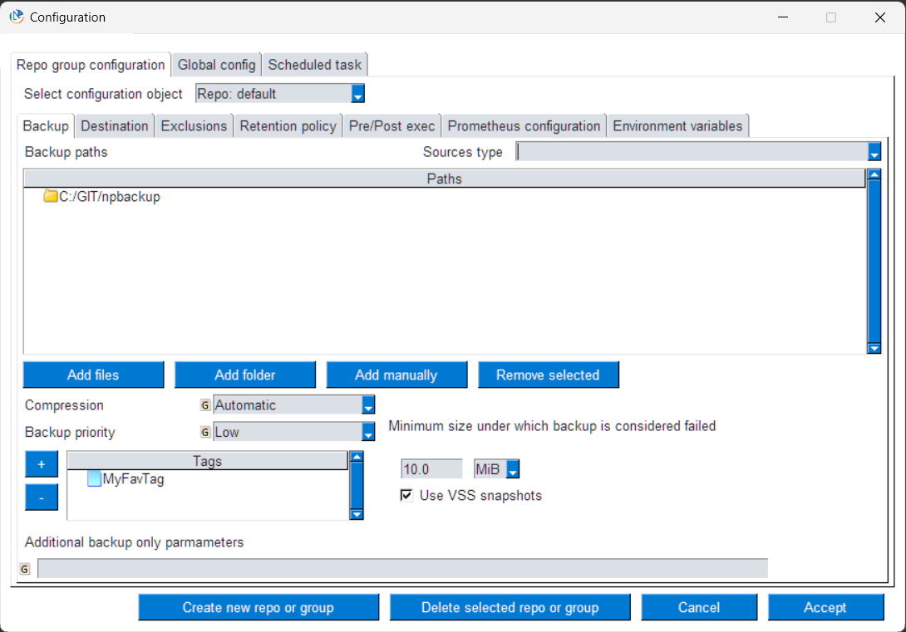
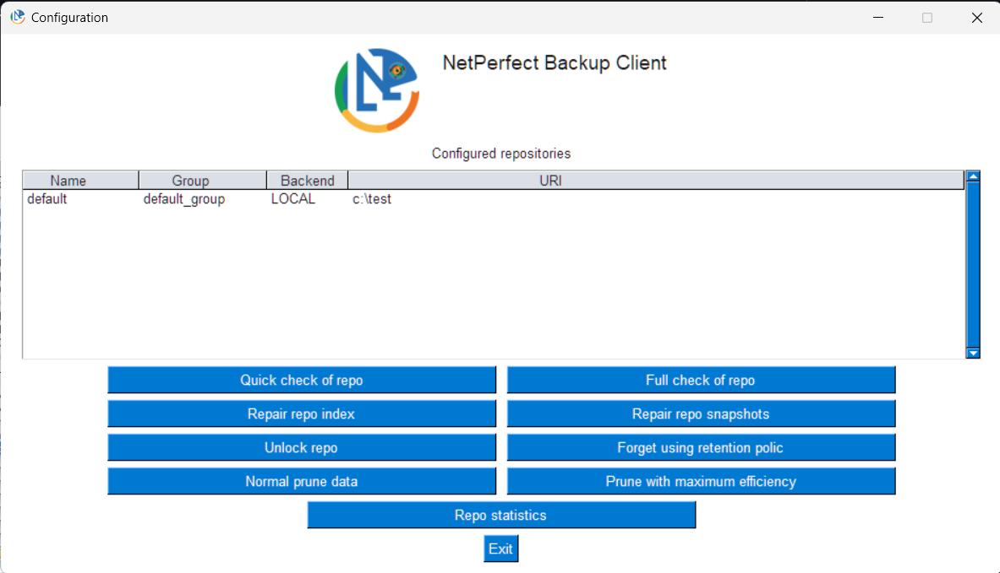
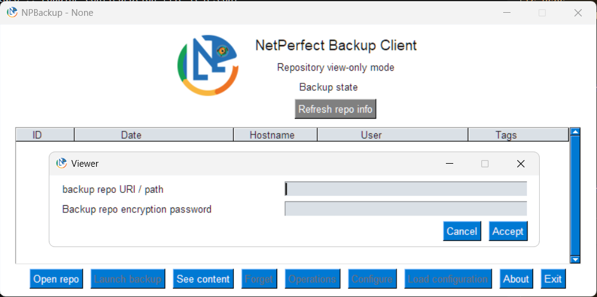
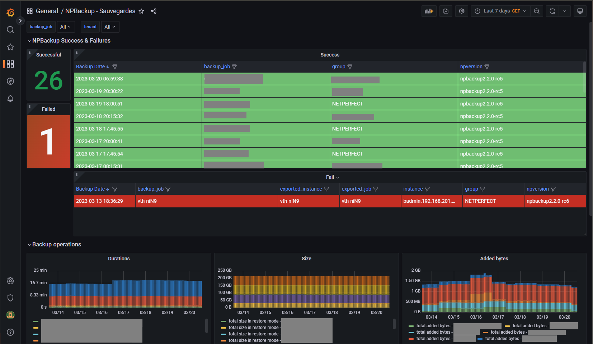

[](https://opensource.org/licenses/GPL-3.0)
[](http://isitmaintained.com/project/netinvent/npbackup "Percentage of issues still open")
[](https://github.com/netinvent/npbackup/releases/latest)
[](https://github.com/netinvent/npbackup/actions/workflows/pylint-windows.yaml)
[](https://github.com/netinvent/npbackup/actions/workflows/pylint-linux.yaml)

# NPBackup

A secure and efficient file backup solution that fits both system administrators (CLI) and end users (GUI)  
Includes an orchestrator that can schedule checks and retention policy operations on groups of backup repositories.

Works on x64 **Linux** , **NAS** solutions based on arm/arm64, **Windows** x64 and x86 and MacOS X.



## V3 Release candidate available
Please check https://github.com/netinvent/npbackup/releases

## Features

- Multiple repositories support
  - Repository group settings
  - Group operations
- Data deduplication and fast zstd compression*
- Client side data encryption*
- Wide storage backend support*
  - local files*
  - SFTP*
  - High performance HTTP REST server*
  - Amazon S3/Minio/Wasabi*
  - Blackblaze B2*
  - Microsoft Azure Blob Storage*
  - Google Cloud Storage*
  - OpenStack Swift*
  - Alibaba Cloud (Aliyun) Object Storage System (OSS)*
- Resume on interrupted backups*
- Full CLI interface with all previous options, including --json API mode
  - Checks for recent backups before launching a backup
- End User GUI
  - Backups create, list, viewer and restore
  - Full configuration interface
  - Internationalization support (en, fr as of Apr 2024)
- Performance
  - Backup process and IO priority settings
  - Upload / download speed limits*
  - Remote connectivity concurrency settings*
- Per repo / group retention policies
  - Will also avoid wrong date data destruction via optional NTP queries
- Housekeeping option which will perform check, forget and prune in one run
- Comes with full exclusion lists for Linux and Windows
- First class prometheus support
  - Restic results metric generation
  - Grafana dashboard included
  - node_exporter file collector support
  - Optional push gateway metrics uploading
- First class Windows support
  - VSS snapshots*
  - Automatic cloud file exclusions (reparse points)
  - Windows pre-built executables*
- Additional security
  - Repository uri / password, http metrics and upgrade server passwords are AES-256 encrypted
  - Repository permissions allowing to limit clients
    - Backup only permission
    - Backup, list and restore permissions
    - Full permissions including destructive operations
  - Encrypted data viewing requires additional password
  - AES-256 keys can't be guessed in executables thanks to Nuitka Commercial compiler
  - External AES-256 keys are obfuscated
- Easy configuration via YAML file (or via GUI)
- Remote automatic self upgrade capacity
  - Included upgrade server ready to run in production

(*) Feature provided by [restic](https://restic.net) backup backend

## About

So, a new backup solution out of nowhere, packed with too much features for it's own good ? Not really !

NPBackup relies on the well known [restic](https://restic.net) backup program, which has been battle proven for years.
While restic is a fanstastic program, NPBackup expands restic by offering a wider set of features.  
Still, NPBackup repos are basically managed by restic, and can be viewed / restored / maintained by restic.

## Quickstart

NPBackup consists of four programs:
- npbackup-cli: CLI version of the backup program
- npbackup-gui: GUI version of the backup program, useful to create YAML config files and for end users, can also act as cli
- npbackup-viewer: View and restore restic repositories without configuration
- upgrade_server: Separate server to provide npbackup clients with newer binaries

You may install npbackup via PyPI or use the pre-built executables.

### Prebuilt executables
On linux, uncompress the NPBackup tar.gz corresponding to your platform to `/usr/local/bin`, or wherever you want.  
You'll get `/usr/local/bin/npbackup-cli`, `/usr/local/bin/npbackup-gui` or `/usr/local/bin/npbackup-viewer` depending on the flavor you have chosen. 
You'll need to have write permissionds to `/var/log`. If not, you can specify an alternative log file via `--log-file /my/writable/path/npbackup.log`  
Any distribution with glibc >= 2.17 should do.

On Windows, you should decompress zip archive and run the executable inside it.
The x64 binary is compatible with Windows 10+. The x86 binary is compatible with windows Vista and higher. On those old systems, you might need to install Visual C runtime 2015.

### PyPI installation

If you don't want to use the pre-built executables, you can install via pip with `pip install npbackup` or `pip install npbackup==3.0.0rc9` currently.

Python requirement: 3.7+

Note that if you want to use the GUI, you'll also need to install tkinter via `yum install python-tkinter` or `apt install python3-tk`.

### Setup

Copy the example config from model `examples/npbackup.conf.dist` into the directory where npbackup is installed.  
Also copy the `excludes` directory if you plan to use the prefilled bigger exclusion lists for your backups.

You can adjust the parameters directly in the file, or via a config GUI by launching `npbackup --config-file=npbackup.conf --config-gui`

Once configured, you can launch manual backups via `npbackup --backup`. Those can be scheduled.
Windows schedule can be created from the configuration page. On Linux, you'll have to create a cronjob or a systemd timer.

Since NPBackup is configured to only proceed with backups when no recent backups are detected, you should consider scheduling npbackup executions quite often.
The default schedule should be somewhere around 15 minutes.

You can use `npbackup --list` or the GUI to list backups.

The GUI allows an end user to check current backups & restore files.rom backups:

The YAML configuration file encrypts sensible data so the end user doesn't have to know repository URI or password.

## Quickstart GUI

Just run the npbackup-gui executable and configure it.  
Prebuilt binaries can be found [here](https://github.com/netinvent/npbackup/releases)



Restore window allows to browse through backups and select what files to restore.  
**There is also a viewer mode that allows to browse all restic repositories without the need to configure anything, see below**



Configuration allows to edit the YAML configuration files directly as end user



Orchestrator GUI allows to run commands on multiple repositories or groups.

**Security**
NPBackup' security model relies on symmetric encryption of all sensible data that allows to access a repository.  
In order to achieve this, NPBackup contains an AES-KEY that can be set:
 - at compile time
 - at run time via an AES-KEY file

Please note that right clicking on "<encrypted data>" in the configuration GUI will allow to decrypt that data, by prompting a backup admin password.
That password is set at compile-time and should be different depending on the organization.

This allows a system admin to see repo URI and passwords, without leaving this information available on the computer.

The configuration file should never be world readable, as one could change the backup admin password, allowing to decrypt other parts of the conf file.

### NPBackup viewer

`npbackup-viewer` provides an easy to use GUI to view contents of various restic repositories, and restore files.  
It accepts npbackup configuration files, restic style `RESTIC_REPOSITORY` and `RESTIC_PASSWORD` environment variables, and can virtually open and restore any restic repository.  
Any optional S3/AWS/Google configuration can be set via the same environment variables restic uses.  
If no configuration file nor environment variables are set, it will ask for repository and password settings.  



## The difficulty of laptop backups

As a matter of fact, laptop backups are the hardest. No one can predict when a laptop is on, and if it has access to internet.
Creating a backup strategy in those cases isn't a simple task.

NPBackup solves this by checking every 15 minutes if a backup newer than 24h exists.
If so, nothing is done. In the case no recent backup exists, a backup is immediately launched.
OF course, both time options are configurable.
In order to avoid sluggish user experience while backing up, process and io priority can be lowered.
Once done, NPBackup can send backup results in Prometheus format directly to a push gateway, for prometheus to catch them.

## A good server backup solution

Server backups can be achieved by setting up a scheduled task / cron job manually or via integrated task creation.

Of course, since NPBackup supports pre-exec and post-exec commands, it can be used to backup various services like virtual hosts or databases where snapshot/dump operations are required (especially with new stdin_from_command parameter).  

## Monitoring

NPBackup includes full prometheus support, including grafana dashboard.
On servers, we'll configure a prometheus file that gets written on each backup, and later can be collected by node_exporter.

On laptops, since we might be away from our usual network, we'll push the backup metrics to a remote push gateway which laters gets collected by prometheus itself.

The current NPBackup dashboard:


## End user expericence

While admin user experience is important, NPBackup also offers a GUI for end user experience, allowing to list all backup contents, navigate and restore files, without the need of an admin. The end user can also check if they have a recent backup completed, and launch backups manually if needed.

## CLI usage

`npbackup-cli` has all the functions the GUI has, and can run on any headless server.  
It also has a `--json` parameter which guarantees parseable output.

`--group-operation [operation]` allows to run an operation on multiple repos. This paramater also requires `--repo-group` or `--repo-name` parameter. For operations requiring arguments, provide the argument to the original operation parameter.
`--repo-name` allows to specify one or multiple comma separated repo names
`--repo-group` allows to specify one or multiple comme separated repo group names

`npbackup-gui` can also act as cli if run with `--run-as-cli` parameter, allowing to use a single executable for GUI and tasks.

## Security

NPBackup inherits all security measures of it's backup backend (currently restic with AES-256 client side encryption including metadata) and all security options from it's storage backends.

On top of those, NPBackup itself encrypts sensible information like the repo uri and password, as well as the metrics http username and password.  
This ensures that end users can backup/restore data without the need to know any password, avoiding secret compromission.  
Note that NPBackup uses an AES-256 key itself, in order to encrypt sensible data. The public (git) version of NPBackup uses the default encryption key that comes with the official NPBackup repo.

You can generate a new AES-256 key with `npbackup-cli --create-key npbackup.key` and use it via an environment variable:

Use a file
```
export NPBACKUP_KEY_LOCATION=/path/to/npbackup.key
```

Use a command that provides the key as it's output
```
export NPBACKUP_KEY_COMMAND=my_key_command
```

You may also compile your own NPBackup executables that directly contain the AES-256 key. See instructions in PRIVATE directory to setup keys.

## Permission restriction system

By default, npbackup is allowed to execute all operations on a repo.  
There are some situations where an administrator needs to restrict repo operations for end users.  
In that case, you can set permissions via the GUI or directly in the configuration file.

Permissions are:
- full: Set by default, allows all including destructive operations
- restore: Allows everything backup does plus restore, check and dump operations
- backup: Allows, backup and snapshot/object listing operations

## Logs

On Unix, logs will be found in `/var/log` unless the directory is not writable. In that case, we'll write into a temporary directory.  
On Windows, logs will be found in the current directory, or in temp directory defined in `%TEMP%` variable or `%WINDIR%\TEMP` when current directory isn't writable.  
You can also use `--log-file` to specify an alternative log file path.

## Upgrade server

NPBackup comes with integrated auto upgrade function that will run regardless of program failures, in order to lessen the maintenance burden.  
The upgrade server runs a python asgi web server with integrated HTTP basic authentication, that can further be put behind an SSL proxy like HaProxy.

## Branding

NPBackup is fully customizable and branding can be done easily.  
You'll find all images and icons in the `resources` directory. Feel free to update those files. Once updated, you must run `update_custom_resources.py` to regenerate the `customization.py` file corresponding entries.  
The file `customization.py` also contains OEM strings that can be safely changed, except for the license text which must stay unaltered.

## Compilation

In order to fully protect the AES key that is needed to support NPBackup, one can compile the program with Nuitka.
Compiling needs restic binary for the target platform in `RESTIC_SOURCE_FILES` folder, files must be named `restic_{version}_{platform}_{arch}[.extension]` like provided by restic.net or [github](https://github.com/restic/restic)
Linux binaries need to be made executable in the `RESTIC_SOURCE_FILES` folder.  
You can use `update_restic.sh` script in `RESTIC_SOURCE_FILES` to download binaries.

You'll need to change the default AES key in `secrets.py`, see the documentation in the file itself.

One you're setup, you need to install compilation tools, see `requirements-compilation.txt` file.

Compile options are available in `compile.py`.

We maintain a special 32 bit binary for Windows 7 which allows to backup those old machines until they get replaced.

We also compile our linux target on RHEL 7 in order to be compatible with reasonably old distributions (>= glibc 2.17).

arm and arm64 builds are compiled on Debian stretch for use with glibc > 2.24.

On most Linux distributions, you might get your glibc version by running `find /usr -name "libc.so.6" -exec "{}" \;`

## Smart shield, antivirus and reputation

Official binaries for Windows provided by NetInvent are signed with a certificate, allowing to gain trust and reputation in antivirus analysis.  
Also, official binaries are compiled using Nuitka Commercial grade, which is more secure in storing secrets.  

Pre-compiled builds for Windows have been code signed with NetInvent's EV certificate, using [windows_tools.signtool](github.com/netinvent/windows_tools)  
Signing on a Windows machine with Windows SDK installed can be done via `windows\sign_windows.py` script.  
Alternatively, you can sign executables via:
```
from windows_tools.signtool import SignTool
signer = SignTool()
signer.sign(r"c:\path\to\executable", bitness=64)
```

Or as singleliner to use in scripts:
```
python.exe -c "from windows_tools.signtool import SignTool; s=SignTool(); s.sign(r'C:\GIT\npbackup\BUILDS\public\windows\x64\npbackup-viewer-x64.exe')"
```

## Misc

NPBackup supports internationalization and automatically detects system's locale.
Still, locale can be overrided via an environment variable, eg on Linux:
```
export NPBACKUP_LOCALE=en
```
On Windows:
```
set NPBACKUP_LOCALE=en
```

## Special thanks

- Thanks to the Restic Team without which this program would not be possible
- Thanks to https://github.com/Krutyi-4el who packaged i18nice internationalization for us
- Special thanks to the BTS SIO 2nd year class of 2022 at Lycee Marillac / Perpignan who volunteered as GUI Q&A team
