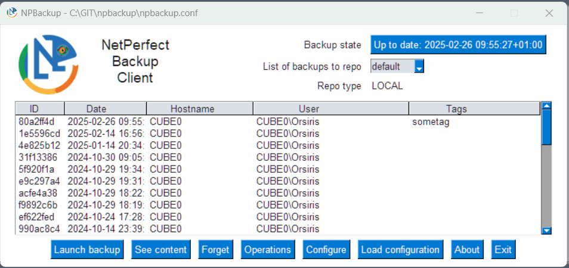

[](https://opensource.org/licenses/GPL-3.0)
[](http://isitmaintained.com/project/netinvent/npbackup "Percentage of issues still open")
[](https://github.com/netinvent/npbackup/releases/latest)
[](https://github.com/netinvent/npbackup/actions/workflows/pylint-windows.yaml)
[](https://github.com/netinvent/npbackup/actions/workflows/pylint-linux.yaml)
[](https://github.com/netinvent/npbackup/actions/workflows/pylint-macos.yaml)
[](https://github.com/netinvent/npbackup/actions/workflows/windows.yaml)
[](https://github.com/netinvent/npbackup/actions/workflows/linux.yaml)
[](https://github.com/netinvent/npbackup/actions/workflows/macos.yaml)
# NPBackup

A secure and efficient file backup solution that fits both system administrators (CLI) and end users (GUI)  
Includes an orchestrator that can handle multiple repositories / groups in order to execute scheduled checks / housekeeping operations.

Works on x64 **Linux** , **NAS** solutions based on arm/arm64, **Windows** x64 and x86 and MacOS X.


## About

So, a new backup solution out of nowhere, packed with too much features for it's own good ? Not really !

NPBackup relies on the well known [restic](https://restic.net) backup program, which has been battle proven for years.  
While restic is a fantastic program, NPBackup expands restic by offering a wider set of features and ecosystem integration.  
Still, NPBackup repos are basically managed by restic, and can be viewed / restored / maintained by standalone restic, so data availability is guaranteed.

## NPBackup Design Philosophy

NPBackup is a multiparadigm backup solution which tries to solve two major backup problems, server and laptop backups!  
The core design idea is to make backups available (obviously !), even partial, on system / network failures.  

>[!TIP]
> It's always better to have some data than none

The NPBackup design is the result of a multitude of real world experience. Examples include:

- For instance, one can configure a "minimum backup size" under which NPBackup reports the backup as failed. Imagine a user moving all it's data from folder A to folder B, while only folder A is setup for backup. Most backup solutions would not complain, but when the time comes for a restore operation, there would be an empty folder. NPBackup informs the monitoring in that scenarios.

- NPBackup checks that all specified backup paths exist prior to launching backups, and informs the monitoring if paths disappeared

- pre and post exec commands have timeouts. There are way too many situations where a pre command is stuck, so backup never happens.

- retention policies can check an optional NTP server. Imagine the scenario where you keep last 12 months of backups, but someone setups your computer's date to 2037 ! On next retention run, you would loose all backups. Also, retention policy is configured by default to always keep at least the 3 most recents backups, regardless of their date.

- Execution never happens, so monitoring doesn't show any errors. Once NPBackup has reported to the monitoring, the dashboard will show every client that hasn't successfully reported in days, making it easy to spot non-working clients

>[!TIP]
> It's always better to have too many alerts than none

It is a set and forget solution. Still, every operation can send a metric to a prometheus monitoring system. Because forgetting the admin burden is okay only when everything is well monitored.

#### The difficulty of laptop backups

As a matter of fact, achieving laptop backups isn't easy. No one can predict when a laptop is on, and when it has internet access. A scheduled backup strategy will fail randomly in that case.

NPBackup solves this by checking every couple of minutes if a recent backup exists.
If a recent backup already exists, it will recheck later, or else, it will launch a backup immediately.
In order to avoid a sluggish user experience while the backup is in progress, process and io priority are set to low by default.  
Note that both the check interval and what's called recent backup (like a less than 24h old backup) options can be configured.  
NPBackup also triggers Windows VSS, but still will proceed with backups on VSS failures, allowing a backup to exist in all scenarios.

NPBackup also has the ability to launch housekeeping operations after backups in a random chance way (0-100%) so we don't get to run housekeeping after every backup.


#### The usual server backup solution

It's always most advisable to do server backups as complete disk images, which is especially easy when run as virtual machine.  
But in a world of cloud servers, one needs a backup solution that will run inside a VM (or baremetal), and backup various services likes files and/or databases where snapshots/dump operations are required.  

NPBackup can run pre-exec and post-exec commands (with timeouts and failure action), can accept direct database dumps via stdin_from_command parameter, can trigger VSS on windows and can exclude various unnecessary files. 

Backups are run by setting up a scheduled task / cron job manually or via integrated task creation.

## Features

#### User experience

- Multi repository support (with group settings inheritance)
- Group operations via orchestrator
- Housekeeping operations that run checks and retention policies on all requested backup repositories
- First class Windows support
  - VSS snapshots*
  - Automatic cloud file exclusions (reparse points)
  - Windows pre-built executables*
- Easy configuration via GUI or CLI yaml files
- Remote automatic self upgrade capabilities
- Included upgrade server ready to run in production
- Fullblown CLI interface with optional --json API mode
- End User GUI
  - Optional viewer-only binaries
  - Internationalization support (en, fr as of Apr 2024)
- Comes with full exclusion lists for Linux, Synology and Windows OSes

#### Availability 

- Wide storage backend support*
  - local files*
  - SFTP*
  - High performance HTTP REST server*
  - Amazon S3/Minio/Wasabi*
  - Blackblaze B2*
  - Microsoft Azure Blob Storage*
  - Google Cloud Storage*
  - OpenStack Swift*
  - Alibaba Cloud (Aliyun) Object Storage System (OSS)*
  - Rclone support*
- Resume on interrupted backups*
- VSS snapshot fallback

#### Security

- Client side data encryption*
- Repository uri / password, http metrics and upgrade server passwords are AES-256 encrypted
- Permission system to limit client operations:
    - Backup only permission
    - Backup, list and restore permissions
    - Restore only permissions
    - Full permissions including destructive operations
- Optional manager password to edit permissions & view encrypted data
- AES-256 keys can't be easily guessed in executables thanks to Nuitka Commercial compiler and programming hygiene
- External AES-256 keys obfuscation


#### Integrity

- Housekeeping operation that checks all repositories before running retention policies
- Retention policies can be executed with opt-in NTP queries in order to avoid date attacks
- Check / repair repository options*
- Minimum backup size checks
- Missing / moved backup location check

#### Performance

- Data deduplication and fast zstd compression*
- Backup process and IO priority settings
- Upload / download speed limits*
- Remote connectivity concurrency settings*

#### Logging

- First class prometheus monitoring support
  - Restic results metric generation
  - Grafana dashboard included
  - node_exporter file collector support
  - Optional push gateway metrics uploading

(*) Feature provided by [restic](https://restic.net) backup backend

## Quickstart

NPBackup consists of four programs:
- npbackup-cli: CLI version of the backup program (see --help)
- npbackup-gui: GUI version of the backup program, useful to create YAML config files and for end users, can also act as cli
- npbackup-viewer: View and restore restic repositories without configuration
- upgrade_server: Separate server to provide npbackup clients with newer binaries

You may install npbackup via PyPI or use the pre-built executables.

### Prebuilt executables

On linux, uncompress the NPBackup tar.gz archive corresponding to your platform to `/usr/local/bin`, or wherever you want.  
You'll get `/usr/local/bin/npbackup-cli`, `/usr/local/bin/npbackup-gui` or `/usr/local/bin/npbackup-viewer` depending on the flavor you have chosen. 
You'll need to have write permissionds to `/var/log`. If not, you can specify an alternative log file via `--log-file /my/writable/path/npbackup.log`  

Linux distributions comes in two flavors:
- legacy: any distribution with glibc >= 2.17 should work (compiled on RHEL 7)
- non legacy: any distribution with glibc >= 2.34 should work (compiled on RHEL 9)
- arm and arm64 builds are compiled on Debian stretch for use with glibc > 2.2

On Windows, you should decompress the zip archive and run the executable inside it.
The x64 binary is compatible with Windows 10+. The x86 binary is compatible with windows Vista and higher. On those old systems, you might need to install Visual C runtime 2015.

For other install methods, please see the [wiki](https://github.com/netinvent/npbackup/wiki)


## Quickstart GUI



Launch the npbackup-gui executable and setup a new configuration.  
Prebuilt binaries can be found [here](https://github.com/netinvent/npbackup/releases)


Restore window allows to browse through backups and select what files to restore.  
**There is also a viewer mode that allows to browse all restic repositories without the need to configure anything, see below**


Configuration allows to edit the YAML configuration files directly as end user


Orchestrator GUI allows to run commands on multiple repositories or groups.


### NPBackup viewer

`npbackup-viewer` provides an easy to use GUI to view contents of various restic repositories, and restore files.  
It accepts npbackup configuration files, restic style `RESTIC_REPOSITORY` and `RESTIC_PASSWORD` environment variables, and can virtually open and restore any restic repository.  
Any optional S3/AWS/Google configuration can be set via the same environment variables restic uses.  
If no configuration file nor environment variables are set, it will ask for repository and password settings.  


## Monitoring

NPBackup includes full prometheus support, including grafana dashboard.
On servers, we'll configure a prometheus file that gets written on each backup, and later can be collected by node_exporter.

On laptops, since we might be away from our usual network, we'll push the backup metrics to a remote push gateway which laters gets collected by prometheus itself.

The current NPBackup dashboard:


## End user expericence

While admin user experience is important, NPBackup also offers a GUI for end user experience, allowing to list all backup contents, navigate and restore files, without the need of an admin. The end user can also check if they have a recent backup completed, and launch backups manually if needed.

## CLI usage

Please refer to the wiki for CLI usage details.

## Logs

On Unix, logs will be found in `/var/log` unless the directory is not writable. In that case, we'll write into a temporary directory.  
On Windows, logs will be found in the current directory, or in temp directory defined in `%TEMP%` variable or `%WINDIR%\TEMP` when current directory isn't writable.  
You can also use `--log-file` to specify an alternative log file path.

## Upgrade server

NPBackup comes with integrated auto upgrade function that will run regardless of program failures, in order to lessen the maintenance burden.  
The upgrade server runs a python asgi web server with integrated HTTP basic authentication, that can further be put behind an SSL proxy like HaProxy. See the wiki for more.

## Branding

NPBackup is fully customizable and branding can be done easily. See the compilation instructions in the wiki for more.

## Misc

NPBackup supports internationalization and automatically detects system's locale.
Still, locale can be overridden via an environment variable, eg on Linux:
```
export NPBACKUP_LOCALE=en-US
```
On Windows:
```
set NPBACKUP_LOCALE=en-US
```
Currently supported: `en-US`, `fr-FR`  

## Special thanks

- Thanks to the Restic Team without which this program would not be possible
- Thanks to https://github.com/solaluset who packaged i18nice internationalization for us
- Special thanks to the BTS SIO 2nd year class of 2022 at Lycee Marillac / Perpignan who volunteered as GUI Q&A team
- Thanks to @Guitarbilly for his efforts in reporting bugs, asking questions, and general improvement suggestions
